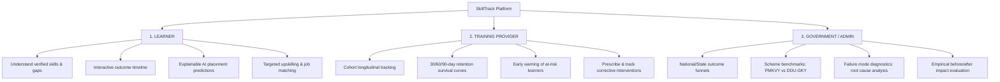

# SkillTrack: Longitudinal Skilling Outcome Intelligence & Impact Measurement Platform

> **Tagline:** *"From Skill Completion to Real-World Outcomes"*  
> **Full Title:** SkillTrack: Longitudinal Skilling Outcome Intelligence & Impact Measurement Platform  
> **Target Context:** Indian Skilling Ecosystem (Operating downstream of Skill India Digital Hub / SIDH)

---

## 1. Product Purpose & Architectural Positioning

SkillTrack is an **outcome-intelligence platform** for the skilling ecosystem.

**What SkillTrack is NOT:**
- ❌ Not a generic LMS (Learning Management System)
- ❌ Not another course marketplace
- ❌ Not a simple job board
- ❌ Not a conversational chatbot
- ❌ Not merely a static dashboard
- ❌ Not a replacement for Skill India Digital Hub (SIDH)

**What SkillTrack IS:**
> **"SkillTrack converts post-training longitudinal outcome data into actionable intelligence."**

Existing platforms primarily track *inputs* (enrollment, course attendance, and certificate issuance). SkillTrack focuses on what happens **after and around skilling**:

$$\text{Track} \longrightarrow \text{Diagnose} \longrightarrow \text{Predict} \longrightarrow \text{Intervene} \longrightarrow \text{Follow-up} \longrightarrow \text{Measure} \longrightarrow \text{Improve}$$

---

## 2. The Core 3-Role Architecture

SkillTrack delivers role-tailored intelligence across three distinct stakeholder groups:



---

## 3. The Primary Demo Journey

The application is structured around an end-to-end working demonstration:

1. **Learner (Rahul Sharma, Delhi NCR):**
   - Completed 16-week Training (88% attendance, 84% practical score).
   - Earned NSQF Level 5 Certificate in Junior Data Operations.
   - Currently **Unplaced (Seeking Job)** 45 days post-certification.
2. **Diagnosis & Explainable Prediction:**
   - Skill Gap Engine compares Rahul's profile with Delhivery's opening: Matched on Python (78%) and SQL (74%), but detects a **0% critical deficit in Power BI** and a below-benchmark mock interview score (42/100).
   - Explainable AI Engine forecasts **58% Placement Probability (Medium Risk)** with transparent positive drivers and risk drivers.
3. **Prescriptive Intervention:**
   - Training Provider (Apex Skilling Academy) prescribes a **14-Day Power BI Accelerated Bootcamp** and **1-on-1 Mock Interview Drills**.
4. **Follow-up & Outcome:**
   - Learner completes bootcamp, clears recruitment screening, and secures placement at ₹20,500/mo.
   - Provider logs **30-Day and 60-Day retention check-ins** confirming wage slip and job continuity.
5. **Macro Impact Measurement:**
   - Government Administrator portal reflects the cohort's outcome in Before/After analysis: **+16.5% placement lift** and **+16.6% 90-day retention gain**.

---

## 4. Technology Stack

- **Frontend:**
  - React 19, TypeScript, Vite
  - Tailwind CSS, Lucide React icons
  - Recharts (Funnel, Area, Bar, and Line charts)
  - React Router DOM
- **Backend:**
  - Python 3.14+, FastAPI
  - Pydantic v2 schemas
  - SQLAlchemy 2.0 ORM
  - JWT Authentication & Bcrypt password hashing
- **Database:**
  - Designed for **Neon PostgreSQL** with SSL encryption (`sslmode=require`)
  - Zero-friction fallback to SQLite for immediate offline local development
- **AI/ML Engine:**
  - Transparent, explainable prediction algorithms (Feature attribution and driver ranking)
  - Scikit-learn, NumPy, Pandas

---

## 5. Local Setup & Execution Guide

### Prerequisites
- **Node.js**: v18+ (v24 tested)
- **Python**: v3.10+ (v3.14 tested)
- **Git**

### Step 1: Clone and Configure Environment
```bash
git clone https://github.com/your-username/Skill-Track.git
cd Skill-Track
cp .env.example .env
```
*(Optionally paste your Neon PostgreSQL connection string into `DATABASE_URL` in `.env`. If left default, local SQLite will be used automatically).*

### Step 2: Set Up & Launch the Backend
```bash
cd backend
python -m venv .venv

# On Windows:
.venv\Scripts\activate
# On macOS/Linux:
source .venv/bin/activate

pip install -r requirements.txt

# Seed the database with 30+ synthetic Indian learners, providers, & outcomes
python -m app.seed

# Run the FastAPI server
python -m uvicorn app.main:app --host 0.0.0.0 --port 8000 --reload
```
API Documentation will be live at: [http://localhost:8000/docs](http://localhost:8000/docs)

### Step 3: Run Backend Automated Tests
```bash
cd backend
.venv\Scripts\python.exe -m pytest
```
*(All 7 core API integration tests will run and pass).*

### Step 4: Set Up & Launch the Frontend
In a separate terminal window:
```bash
cd frontend
npm install
npm run dev
```
Open your browser at: **[http://localhost:5173](http://localhost:5173)**

---

## 6. One-Click Demo Personas

When running the application, you can switch seamlessly between all 3 stakeholder perspectives directly from the top navigation bar or via the Login page:

| Persona | Name | Email | Focus View |
| :--- | :--- | :--- | :--- |
| **Learner** | Rahul Sharma | `rahul.sharma@skilltrack.in` | Longitudinal Timeline, Skill Gaps, XAI Diagnostics |
| **Training Provider** | Dr. Sunita Rao | `director@apexskills.org` | Cohort Tracking, At-Risk Interventions, Retention Curves |
| **Government Admin** | Rajesh Verma | `admin.msde@gov.in` | National Funnel, Scheme Benchmarks, Before/After Impact |

*Default password for all demo accounts:* `demo1234`

> **Note on Authentication:** In accordance with the GovTech specification, there is **no separate `/login` route**. Access is mediated through a single, unified 2-step modal triggered directly from the public landing page (`/`).

---

## 7. Architecture & Directory Structure

The project has been refactored into an enterprise-grade directory structure:

```
Skill-Track/
│
├── frontend/                     # React + TypeScript + Vite (Google Stitch GovTech Standard)
│   ├── src/
│   │   ├── api/                  # TanStack Query hooks & unified Axios client
│   │   ├── components/
│   │   │   ├── common/           # GovTech KpiCard, StatusBadge, RiskIndicator, TimelineView, XAI Card
│   │   │   ├── layout/           # Civic Navbar (Tricolor strip), Sidebar, Layout
│   │   │   └── ui/               # Standardized Button (40px), Card, Badge, UnifiedLoginModal
│   │   ├── context/              # AuthContext (Role & Token State Management)
│   │   ├── pages/
│   │   │   ├── public/           # Public Home Landing (Hero, 7-Stage Loop, Portals, Impact Stats)
│   │   │   ├── learner/          # Longitudinal Timeline, Skills, Outcomes, XAI Predictions
│   │   │   ├── provider/         # Cohort Tracking, Priority Risk Interventions, Retention Curves
│   │   │   ├── government/       # Policy Filters, 7-Stage Funnel, Failure Modes, State Heatmap, Impact
│   │   │   └── common/           # Jobs, Demand Analysis, Skill Gap Simulator, Settings
│   │   └── styles/               # Public Sans typography, Civic Blue (#0B3B60) design tokens
│   └── package.json
│
├── backend/                      # FastAPI Modular Backend
│   ├── app/
│   │   ├── api/
│   │   │   ├── routes/           # 11 REST route modules (auth, learners, skills, jobs, predictions, etc.)
│   │   │   └── dependencies/     # Dependency injection (database sessions, current user)
│   │   ├── core/                 # JWT security, password hashing, and system settings
│   │   ├── database/             # SQLAlchemy ORM session lifecycle
│   │   ├── models/               # 15+ relational entity models
│   │   ├── schemas/              # Pydantic v2 validation contracts
│   │   ├── services/             # Deterministic Skill Gap Engine, XAI Placement Engine, Impact Analysis
│   │   ├── main.py               # Application entry point with CORS & API routing
│   │   └── seed.py               # Rich synthetic Indian skilling dataset seeder
│   ├── tests/                    # Pytest test suite (36 tests, 100% pass)
│   └── requirements.txt
│
├── database/                     # Dedicated Database Management Layer
│   ├── migrations/               # Alembic database migrations (Neon PostgreSQL target)
│   ├── schema/                   # Schema documentation & entity relationship guides
│   ├── scripts/                  # Maintenance & reset utilities
│   └── seeds/                    # Raw synthetic seed datasets
│
├── ml/                           # Dedicated Machine Learning & Intelligence Layer
│   ├── skill_gap/                # Deterministic Skill Gap Engine with priority ranking
│   ├── prediction/               # Explainable AI Placement Likelihood & Retention Risk
│   ├── models/                   # Serialized model artifacts
│   └── evaluation/               # Metric evaluation scripts
│
├── scripts/                      # Environment & Utility Batch Runners
│   ├── setup/                    # Environment setup scripts
│   ├── seed/                     # Database seeding automation
│   └── utilities/                # System health verification utilities
│
├── docs/                         # Formal Enterprise Documentation
│   ├── PROJECT_SPEC.md           # Master project specification
│   ├── ARCHITECTURE.md           # System architecture & component topology
│   ├── API_SPEC.md               # Complete REST API specifications
│   ├── DATABASE_SCHEMA.md        # PostgreSQL database schema & relational constraints
│   ├── UI_SPEC.md                # Google Stitch GovTech design system specifications
│   └── DEMO_FLOW.md              # Step-by-step SIH hackathon evaluation script
│
├── docker-compose.yml            # Multi-service container specification
└── README.md                     # Project overview & quick-start guide
```

---

## 8. GovTech Design Aesthetics

The user interface strictly adheres to the approved Google Stitch **Skill Track** (*Longitudinal Governance*) design system:
- **Typography:** Google Font **Public Sans** with tabular figures (`tabular-nums`) for numerical metrics.
- **Color Palette:**
  - **Civic Blue (`#0B3B60`):** Primary government branding and structural accents.
  - **Dark Navy (`#002541`):** High-contrast typography and prominent headings.
  - **Analytical Teal (`#006876`):** Secondary metrics and intelligence indicators.
  - **Saffron (`#E65100`):** Priority notices and action flags.
  - **Structural Border (`#D1D9E2`):** Crisp 1px structural framing.
- **Component Geometry:** Standard 38–40px button heights, 4px-6px rounded corners (`rounded-md`), rectangular status badges (never `rounded-full` pills), and crisp white content cards over clean canvas (`#F4F6F9`).

---

## 9. License

Developed for the Smart India Hackathon (SIH) prototype evaluation. Licensed under the MIT License.

