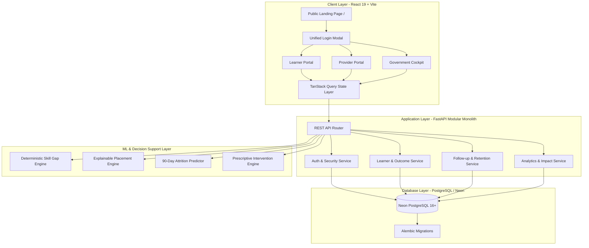

# SkillTrack: System Architecture

SkillTrack is architected as a clean **Modular Monolith** designed for statutory reliability, high throughput, and institutional trust.

## Architectural Responsibilities
- **Frontend (`frontend/`):** React 19 + TypeScript + Tailwind CSS v4. Delivers role-based user interfaces, interactive charts (Recharts), client-side cache management (TanStack Query), and strict GovTech styling.
- **Backend (`backend/`):** FastAPI + SQLAlchemy 2.0 + Pydantic v2. Provides REST API routing, JWT role-based access control, data validation, outcome lifecycle processing, and audit trails.
- **Database (`database/`):** Neon PostgreSQL (or SQLite local fallback). Enforces relational constraints (`chk_learner_age`, `chk_emp_salary`, `uq_learner_skill`, `uq_learner_milestone`), B-tree indexes, and longitudinal event tables.
- **ML & Decision Support (`ml/`):** Provides explainable predictive modeling and deterministic mathematical skill matching without opaque black-boxes.
- **Documentation (`docs/`):** Specifications, architecture blueprints, API definitions, and demo flows.
