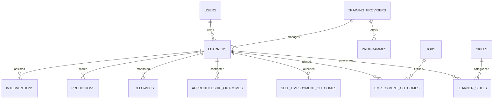

# SkillTrack: Database Schema Specification

The database is designed for **Neon Serverless PostgreSQL** using SQLAlchemy 2.0 and Alembic.

## Entity Relational Architecture

## Core Tables & Constraints

### 1. `users`
- Primary auth identity (email, password_hash, role: `learner`, `provider`, `government`, `admin`).
- Unique Index: `ix_users_email`.

### 2. `learners`
- Demographic and candidate progress repository.
- Fields: `learner_code` (unique), `full_name`, `gender`, `age`, `state`, `district`, `education_level`, `current_status`, `current_salary`, `retention_milestone_reached`, `risk_level`, `skill_match_pct`.
- Check Constraints:
  - `chk_learner_age`: `age >= 14`
  - `chk_learner_risk_level`: `risk_level IN ('Low', 'Medium', 'High')`

### 3. `learner_skills`
- Verified candidate competency vectors.
- Unique Constraint: `uq_learner_skill` (`learner_id`, `skill_id`).
- Fields: `assessed_score`, `proficiency_level`, `verified`, `acquired_from`.

### 4. `employment_outcomes`
- Formal wage placement auditing records.
- Fields: `employer_name`, `designation`, `sector`, `monthly_salary`, `offer_letter_verified`, `pf_uan_verified`, `verification_status`.
- Check Constraints:
  - `chk_emp_salary`: `monthly_salary >= 0`
  - `chk_emp_ver_status`: `verification_status IN ('pending', 'verified', 'rejected', 'under_audit')`

### 5. `followups`
- Longitudinal milestone retention checks (30, 60, 90, 180, 360-day).
- Unique Constraint: `uq_learner_milestone` (`learner_id`, `milestone_interval`).
- Fields: `is_retained`, `current_salary`, `job_satisfaction_score`, `verified_by`.
- Check Constraint: `chk_followup_job_sat`: `job_satisfaction_score BETWEEN 1 AND 5`.

### 6. `predictions`
- Explainable ML risk forecasts.
- Fields: `prediction_type` (`placement_likelihood`, `attrition_risk`), `probability_score`, `risk_tier`, `positive_drivers` (JSON), `risk_factors` (JSON), `recommended_interventions` (JSON).

### 7. `interventions`
- Support actions assigned to at-risk candidates.
- Fields: `intervention_type`, `title`, `description`, `status` (`assigned`, `in_progress`, `completed`), `due_date`.
